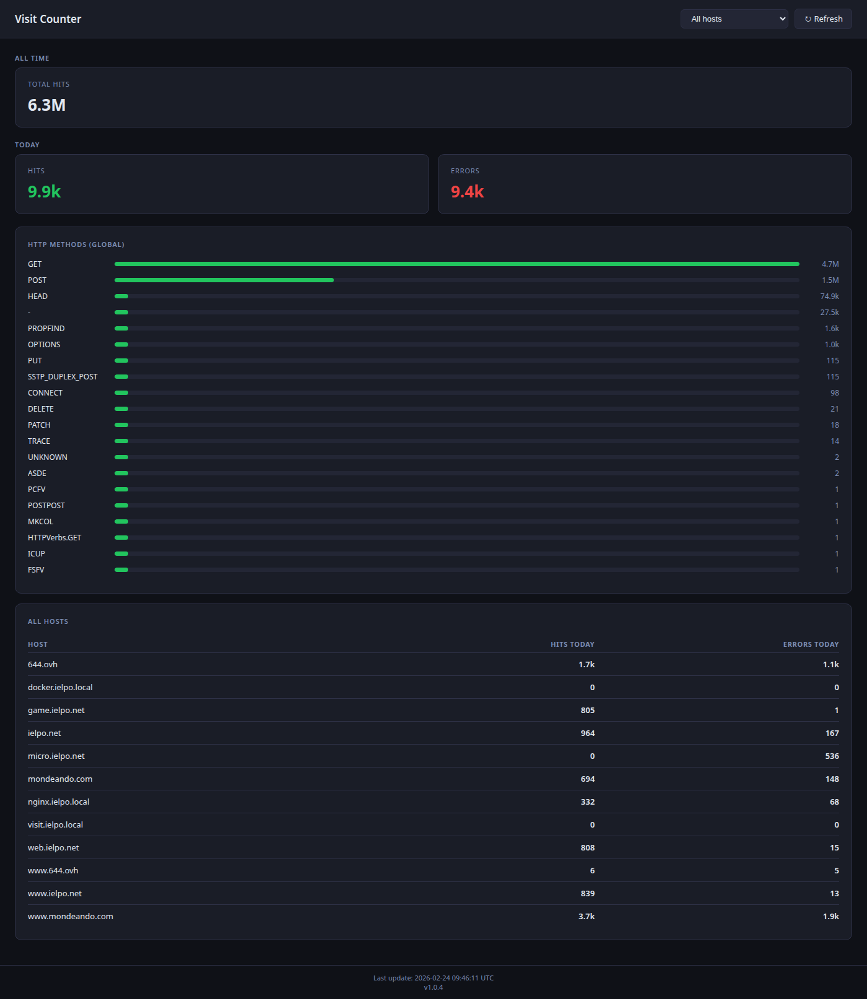
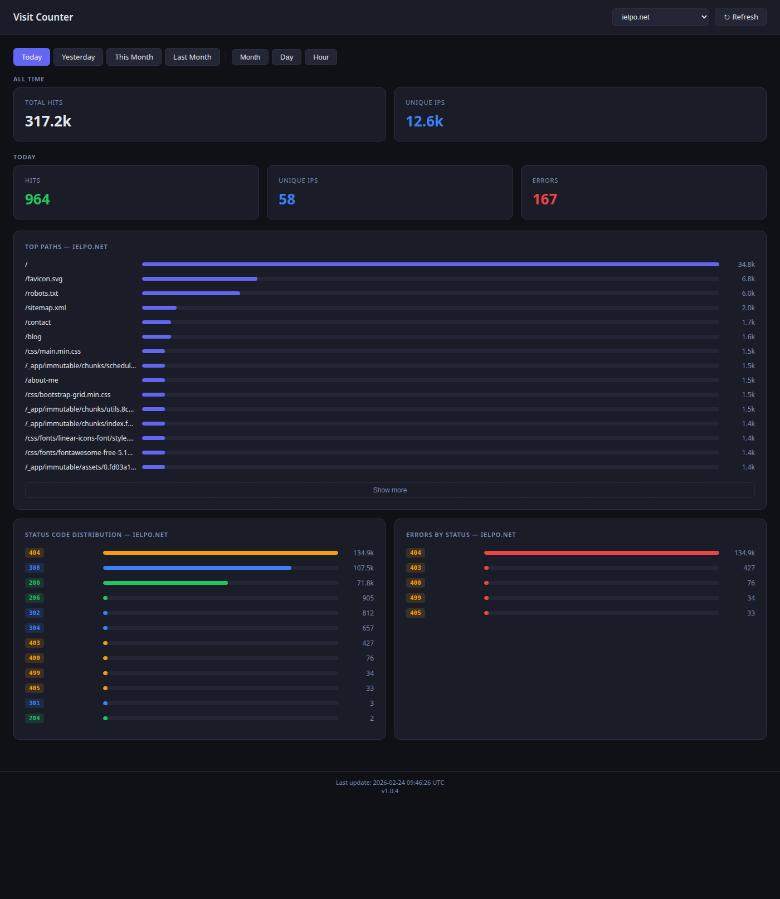

# Visit Counter

> Tail an nginx access log, parse each line, and persist statistics into Redis. Visualise everything through a built-in SSR dashboard.

[](https://nodejs.org)
[](LICENSE)
[](Dockerfile)

---

## Table of Contents

- [How it works](#how-it-works)
- [Nginx log format](#nginx-log-format)
- [Dashboard UI](#dashboard-ui)
  - [Screenshots](#screenshots)
  - [Filtering](#filtering)
  - [REST API](#rest-api)
- [Build](#build)
- [Environment variables](#environment-variables)
- [Run](#run)
- [Host filtering](#host-filtering)
- [Redis key reference](#redis-key-reference)
- [Query examples](#query-examples)

---

## How it works

The program runs in two phases:

1. **Replay** _(optional)_ — if `TAIL_START_TIME` is set, the full log file is read from the beginning and every entry whose timestamp is >= `TAIL_START_TIME` is processed and written to Redis.
2. **Tail** — the program watches the log file for new bytes using `fs.watch`. Incoming lines are parsed and written to Redis in real time. File rotation and truncation are detected automatically (when the file shrinks, the offset resets to 0).

On `SIGTERM` the Redis connection is closed gracefully before the process exits.

---

## Nginx log format

The parser expects a **custom nginx log format** — this is not the default `combined` format. Add the following to your nginx config:

```nginx
log_format main '$remote_addr - $realip_remote_addr [$time_iso8601] "$request_method $scheme://$host$request_uri $server_protocol" '
                '$status $body_bytes_sent "$http_referer" '
                '"$http_user_agent" "$http_x_forwarded_for"';

access_log /var/log/nginx/access.log main;
```

The key differences from the default format are:

- `$realip_remote_addr` is included alongside `$remote_addr`
- The request includes the full URL with scheme and host (`$scheme://$host$request_uri`), used to extract the hostname per request
- Timestamp uses `$time_iso8601`

---

## Dashboard UI

The application ships a built-in web dashboard served by a Fastify HTTP server on port **3000**. Visiting `/` redirects to `/dashboard`.

The dashboard is a server-side rendered (SSR) Handlebars page that displays:

- Overview cards (total requests, unique visitors, visits and errors for the current period)
- Top pages table (most requested paths for a host)
- Status code breakdown (all response codes with counts)
- Error breakdown by status code
- HTTP methods distribution
- All-hosts summary table

### Screenshots

**Overview — all hosts**



**Host view — per-host stats with period selector**



### Filtering

Use the `host` and `period` query parameters to scope the data:

| Parameter | Example values                                                                             | Description                               |
| --------- | ------------------------------------------------------------------------------------------ | ----------------------------------------- |
| `host`    | `example.com`                                                                              | Filter stats to a single tracked hostname |
| `period`  | `today`, `yesterday`, `this-month`, `last-month`, `2026-02`, `2026-02-21`, `2026-02-21T14` | Pre-set label or an ISO date/hour string  |

Example: `http://localhost:3000/dashboard?host=example.com&period=this-month`

### REST API

The same data is also available as JSON through the REST endpoints registered under the following controllers:

- `GET /visits/…` — visit counts
- `GET /errors/…` — error counts
- `GET /stats/…` — total requests, status codes, methods, top paths
- `GET /unique/…` — unique IP counts

---

## Build

```bash
docker build . -t visit-counter
```

---

## Environment variables

| Variable             | Default                  | Description                                                                                                                                                   |
| -------------------- | ------------------------ | ------------------------------------------------------------------------------------------------------------------------------------------------------------- |
| `TAIL_LOG_FILE`      | `{cwd}/tmp/access.log`   | Path to the nginx access log file inside the container                                                                                                        |
| `REDIS_URL`          | `redis://localhost:6379` | Redis connection URL                                                                                                                                          |
| `TAIL_START_TIME`    | _(unset)_                | ISO 8601 date — if set, replays the log from this timestamp before entering tail mode                                                                         |
| `TAIL_OFF`           | _(unset)_                | If set to `true`, the program exits after the replay phase without entering tail mode                                                                         |
| `TAIL_ALLOWED_HOSTS` | _(unset)_                | Comma-separated list of domains to track (e.g. `ielpo.net,mondeando.com`). Only exact hostname matches are tracked. If unset, all valid hostnames are tracked |
| `TAIL_PRINT_ENTRIES` | `false`                  | Set to `true` to print each parsed log entry to stdout with color-coded status codes                                                                          |
| `APP_ENV`            | _(unset)_                | Runtime environment.                                                                                                                                          |
| `LOG_LEVEL`          | `notice`                 | Pino log level (`trace`, `debug`, `info`, `notice`, `warn`, `error`, `fatal`)                                                                                 |

---

## Run

### Docker compose

```bash
NGINX_ACCESS_LOG=/var/log/nginx/access.log \
REDIS_DATA=/var/docker_volumes/visit-counter-redis \
docker compose up -d
```

| Variable           | Default                                    | Description                                    |
| ------------------ | ------------------------------------------ | ---------------------------------------------- |
| `NGINX_ACCESS_LOG` | `./tmp/access.log`                         | Host path to the nginx access log file         |
| `REDIS_DATA`       | `/var/docker_volumes/visit-counter-redis`  | Host path where Redis persists its data        |

### Local development

```bash
npm install
npm start            # compile TypeScript + run
```

---

## Host filtering

Hostnames are extracted from the full URL captured in each log line (`$scheme://$host$request_uri`). A hostname is rejected (tracked as `unknown`) if:

- It does not conform to RFC-1123 (invalid characters, labels starting/ending with a hyphen, etc.)
- It is a raw IPv4 address
- It has more than 3 dot-separated labels (bot-flood protection)
- `TAIL_ALLOWED_HOSTS` is set and the hostname does not exactly match any listed domain

Requests tagged as `unknown` are still counted in total_requests, status, and method stats — they are simply grouped under the `unknown` field in every hash key.

---

## Redis key reference

### Visits (2xx responses only)

| Key                             | Type | Description                         |
| ------------------------------- | ---- | ----------------------------------- |
| `visits:hourly:{YYYY-MM-DDTHH}` | Hash | Visits per host for the given hour  |
| `visits:daily:{YYYY-MM-DD}`     | Hash | Visits per host for the given day   |
| `visits:monthly:{YYYY-MM}`      | Hash | Visits per host for the given month |

### Unique IPs (1xx, 2xx, 3xx responses only)

Unique IPs are tracked only for requests that received a valid HTTP response (1xx, 2xx, 3xx). Error responses (4xx, 5xx) and malformed status codes are excluded.

| Key                                        | Type | Description                             |
| ------------------------------------------ | ---- | --------------------------------------- |
| `unique_ips:{host}`                        | Set  | All-time unique IP count for a host     |
| `unique_ips:hourly:{YYYY-MM-DDTHH}:{host}` | Set  | Unique IPs per host for the given hour  |
| `unique_ips:daily:{YYYY-MM-DD}:{host}`     | Set  | Unique IPs per host for the given day   |
| `unique_ips:monthly:{YYYY-MM}:{host}`      | Set  | Unique IPs per host for the given month |

### Errors (status NaN, < 100, or >= 400)

4xx and 5xx responses are counted as errors. 1xx, 2xx, and 3xx responses are not. Requests with a missing or unparseable status code are also counted as errors.

| Key                             | Type | Description                                     |
| ------------------------------- | ---- | ----------------------------------------------- |
| `errors:hourly:{YYYY-MM-DDTHH}` | Hash | Errors per host for the given hour              |
| `errors:daily:{YYYY-MM-DD}`     | Hash | Errors per host for the given day               |
| `errors:monthly:{YYYY-MM}`      | Hash | Errors per host for the given month             |
| `errors:by_status:{host}`       | Hash | All-time error count per status code for a host |

### Other stats

| Key                      | Type       | Description                                       |
| ------------------------ | ---------- | ------------------------------------------------- |
| `stats:total_requests`   | Hash       | All-time request count per host                    |
| `stats:status:{host}`    | Hash       | All-time request count per status code for a host  |
| `stats:methods`          | Hash       | All-time request count per HTTP method (global)    |
| `stats:top_paths:{host}` | Sorted Set | Request count per path for a host                  |
| `stats:last_update`      | String     | ISO 8601 timestamp of the last processed log entry |

---

## Query examples

### Visits

```bash
# Visits per host for a specific hour
HGETALL visits:hourly:2026-02-21T14

# Visits for a specific host in a specific hour
HGET visits:hourly:2026-02-21T14 example.com

# Visits per host for a specific day
HGETALL visits:daily:2026-02-21

# Visits for a specific host on a specific day
HGET visits:daily:2026-02-21 example.com

# Visits per host for a full month
HGETALL visits:monthly:2026-02

# Visits for a specific host in a full month
HGET visits:monthly:2026-02 example.com
```

### Unique visitors

```bash
# All-time unique IP count for a host
SCARD unique_ips:example.com

# All-time unique IPs for a host (list)
SMEMBERS unique_ips:example.com

# Unique IP count for a host in a specific hour
SCARD unique_ips:hourly:2026-02-21T14:example.com

# Unique IPs for a host in a specific hour (list)
SMEMBERS unique_ips:hourly:2026-02-21T14:example.com

# Unique IP count for a host on a specific day
SCARD unique_ips:daily:2026-02-21:example.com

# Unique IPs for a host on a specific day (list)
SMEMBERS unique_ips:daily:2026-02-21:example.com

# Unique IP count for a host in a full month
SCARD unique_ips:monthly:2026-02:example.com

# Unique IPs for a host in a full month (list)
SMEMBERS unique_ips:monthly:2026-02:example.com
```

### Errors

```bash
# Errors per host for a specific hour
HGETALL errors:hourly:2026-02-21T14

# Errors for a specific host in a specific hour
HGET errors:hourly:2026-02-21T14 example.com

# Errors per host for a specific day
HGETALL errors:daily:2026-02-21

# Errors for a specific host on a specific day
HGET errors:daily:2026-02-21 example.com

# Errors per host for a full month
HGETALL errors:monthly:2026-02

# Errors for a specific host in a full month
HGET errors:monthly:2026-02 example.com

# Error breakdown by status code for a host (all-time)
HGETALL errors:by_status:example.com
```

### Other stats

```bash
# All-time requests per host
HGETALL stats:total_requests

# All-time requests for a specific host
HGET stats:total_requests example.com

# Status code distribution for a host
HGETALL stats:status:example.com

# HTTP method distribution
HGETALL stats:methods

# Top 10 most requested paths for a host
ZRANGE stats:top_paths:example.com 0 9 REV WITHSCORES

# Top 20 most requested paths for a host
ZRANGE stats:top_paths:example.com 0 19 REV WITHSCORES

# Timestamp of the last processed log entry
GET stats:last_update
```
